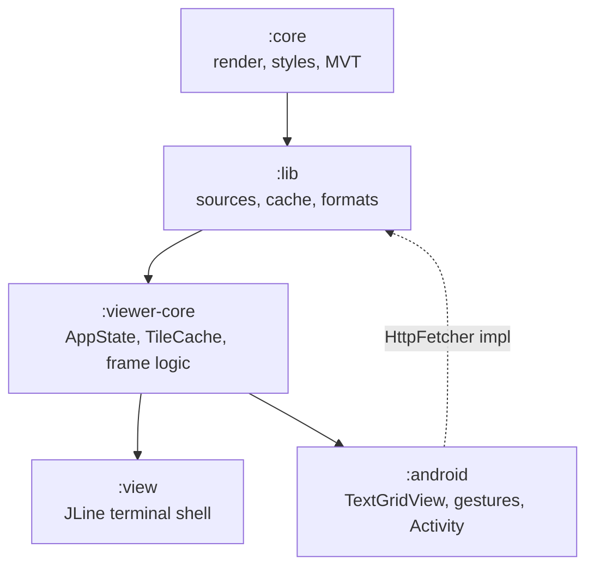
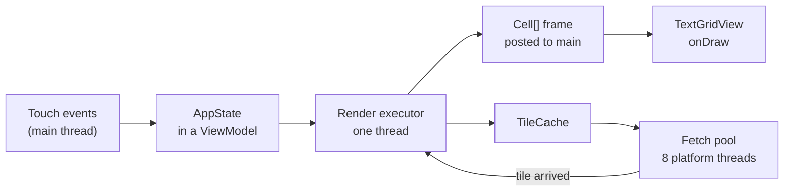
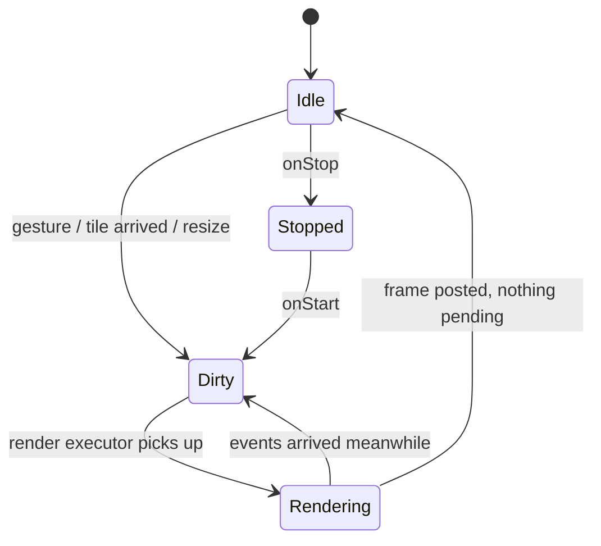

# Terminal Map Renderer — Android Viewer Design

2026-09-18 · @Someone

## Overview

The Android app is `tilemap-view` with a touch screen instead of a keyboard: the same `:core` renderer and `:lib` tile sources, drawn into a custom Android view that paints one glyph per cell. It is not a conventional map app; the point is the text-mode look, on a phone, offline-capable, shareable as text.

The terminal viewer already splits cleanly into a pure model (`AppState`, `TileCache`, prefetch and frame logic in `Viewer`) and a terminal shell (JLine, key decoding, ANSI diffing). The Android app reuses the model and replaces the shell. Three things stand between today's code and an APK:

| Blocker | Where | Fix |
| --- | --- | --- |
| `java.net.http.HttpClient` does not exist on Android | `lib/HttpTileSource` | Put HTTP behind a small `HttpFetcher` interface; JDK and Android implementations |
| Virtual threads and `Thread.ofPlatform` do not exist on Android | `view/Main`, `TileCache` callers | `TileCache` already takes an `Executor`; the app passes a fixed thread pool |
| The reusable viewer classes are package-private inside `:view`, which depends on JLine | `view/AppState`, `TileCache`, `Viewer` | Extract them into a new `:viewer-core` module with no terminal dependency |

Everything that affects what a map looks like stays in `:core`, exactly as the original design demands; the app decides only cell size, gestures and where the pixels go.

## Goals and non-goals

Goals, in priority order:

1. Byte-identical rendering to the terminal viewer: the same `Viewport`, style and `Capabilities` give the same `Canvas`, so the golden tests cover the app's map output too.
2. Every viewer action reachable by touch: pan, zoom (fractional), go-to, inspect, style cycling, labels on/off, copy as text or ANSI.
3. Offline use from a PMTiles archive the user picks with the system file picker.
4. Smooth interaction on a mid-range phone: a 45×40-cell view renders well under the 16 ms frame budget, so rendering runs per gesture event without dropped frames.
5. Share the view as text, HTML or a PNG image.
6. A "my location" marker from the device GPS, since the project is called terminal-gps. Cheap once the core accepts an overlay source (see Open questions).

Non-goals:

- Compose, Kotlin or a full Material app. The project is Java 21 with no Kotlin; the app is Java with AndroidX Views and a single `Activity`.
- Turn-by-turn navigation, routing or search beyond "go to lon,lat". A geocoder is a stretch goal for both viewers, not an Android feature.
- Raster tiles, satellite imagery or anything the core cannot draw as glyphs.
- Tablet or Wear layouts in the first release; the view is a grid and scales by itself, but nothing is tuned for them.

## Architecture

One new library module and one new application module; the dependency direction stays one-way and `:core` stays untouched.



`:viewer-core` is the terminal viewer's model, moved out of `:view` and made public: `AppState`, `TileCache`, `Viewer.prefetch`, `Viewer.tileRect`, the inspect-panel text builder, and `FrameComposer` minus its status-bar and overlay drawing (those are terminal presentation). `:view` keeps `Main`, `JLineDisplay`, `KeyDecoder`, `KeyHandler` and `TerminalProbe`. Nothing in `:viewer-core` may import JLine, `java.net.http` or Java 21 APIs missing from Android.

| Module | Language level | Android-safe? | Notes |
| --- | --- | --- | --- |
| `:core` | Java 21 features, JDK 8-era APIs | Yes, after one change | `Labels.java:214` uses `List.getLast()` (Java 21 `SequencedCollection`, not on Android). Replace with `get(size() - 1)`. |
| `:lib` | Java 21 | After the `HttpFetcher` split | `TileMap.java:43` uses `getFirst()`; `HttpTileSource` and `TileSources` import `java.net.http`. |
| `:viewer-core` | Java 21 | Yes by construction | `Viewer.java:194` `getFirst()`/`getLast()` fixed during the move. |
| `:android` | Java 21 source, D8 desugaring | n/a | Records, sealed types and pattern `switch` are desugared by D8 in AGP 8.4+. |

The HTTP split: `:lib` gains `interface HttpFetcher { Response get(URI uri) throws IOException; }` with `record Response(int status, byte[] body, String cacheControl)`. `HttpTileSource` takes an `HttpFetcher` instead of an `HttpClient`; `JdkHttpFetcher` (in `:lib`, loaded only when `java.net.http` is present) is the default on the JVM, and `:android` ships `UrlConnectionFetcher` on `HttpURLConnection`, which needs no third-party dependency. `TileSources.open` gains an overload that takes the fetcher.

Inside the app the shape mirrors the terminal viewer:



Gesture handling mutates `AppState` on the main thread and marks it dirty; a single-thread render executor coalesces dirty marks the way `Viewer.run` coalesces events, renders a `Canvas`, and posts the frame. `AppState` is touched only under one lock (`synchronized` on the state) rather than by one thread as in the terminal viewer, because Android's input arrives on the main thread and rendering must not.

## Rendering the Canvas on screen

`TextGridView` is a custom `View` that owns the last posted `Cell[]` and paints it in `onDraw`. The map is always a grid of equal cells, so the view decides the cell size and the app derives `cols = width / cellW`, `rows = height / cellH`, which become the `Viewport`. Nothing in the core changes.

Cell size is a user setting in dp (small 6×12, medium 8×16, large 10×20), always exactly 1:2 so the core's default `cellAspect` of 0.5 is correct with no calibration. A 411×823 dp phone at medium gives 51×51 cells (minus a one-row status strip), roughly what a small terminal shows.

Glyphs are drawn two ways, chosen per `Cell.codePoint`:

| Code point range | Drawn as | Why |
| --- | --- | --- |
| Braille U+2800–28FF | 2×4 filled circles from the dot bits | Android system fonts are not guaranteed to have braille, and none of them are monospaced with it |
| Box drawing U+2500–257F, blocks U+2580–259F, shades ░▒▓ | Line and rectangle primitives from a small lookup table | Crisp at any cell size and density; joints meet exactly |
| Sextants U+1FB00–1FB3B | 2×3 filled rectangles | No Android font ships them |
| Everything else (labels, markers, ASCII) | `Canvas.drawText` with a bundled monospace font | Text must look like text |

Drawing the geometric glyphs ourselves removes the font dependency for the map body entirely and gives the same look on every device. The bundled font is DejaVu Sans Mono (free license, has box drawing and braille for the fallback path); labels are drawn with `Paint.setTextSize` fitted so the advance width equals `cellW`.

Color depth is fixed at `ColorDepth.TRUE`: `Cell.fg`/`bg` are `Rgb` and map straight to `Paint` colors. A null `bg` draws the style's background; a null `fg` draws the theme's foreground. The `c` key's cycling through 256/16/none survives as a settings toggle ("retro colors") because that is where the `mono` and `vt220` presets look right, and the core already quantizes.

Per-frame cost: at 51×51 cells that is about 2 600 `drawCircle`/`drawRect` batches. Cells are painted from a `Bitmap` cache keyed by (code point, fg, bg) for repeated glyphs, so a frame is mostly `drawBitmap` calls; measured targets are in Testing. Missing tiles use the same `░` placeholder as the terminal.

The status strip is a one-row `TextView` under the grid with the terminal's `statusLeft` text (center, zoom, tiles loaded/visible, queue, render ms) and the OpenFreeMap attribution, which is a licence requirement and not optional.

## Input

`TouchHandler` is the app's `KeyHandler`: a pure class that turns gesture callbacks into `AppState` calls and returns whether a redraw is needed, so it is unit-testable without Android. `GestureDetector` and `ScaleGestureDetector` feed it; there are no custom recognizers.

| Gesture | Terminal equivalent | `AppState` call |
| --- | --- | --- |
| One-finger drag | mouse drag | `panCells(dx / cellW, dy / cellH)` every move event; fractional pan is already supported, so the map tracks the finger |
| Fling | none | decaying `panCells` from a `Scroller`, stopped by a touch |
| Pinch | wheel | `zoomAt(col, row, log2(scaleFactor))` at the focal point, continuous |
| Double tap | `+` | `zoomAt(col, row, +1)` |
| Two-finger tap | `-` | `zoomBy(-1)` |
| Long press | `i` | inspect at that cell: sets `inspect`, `cursorCol/Row`, opens the bottom sheet |
| Tap while inspecting | arrow keys in inspect | moves the cursor to the tapped cell |
| Back | Esc / `q` | closes inspect, then the sheet, then the app |

The things a keyboard did that touch cannot live in a bottom app bar with five actions: **Go to** (a dialog with `lon,lat[,zoom]`, same parser as the `g` prompt), **Style** (cycles `Styles.PRESETS`, same as `s`), **Labels** (toggle, same as `n`), **Share**, and **Settings**. The help overlay becomes the standard first-run tip; the bar is the help.

Pan direction: dragging moves the map with the finger, so `panCells` gets the negated delta, as the terminal's `MOUSE_DRAG` branch does. Zoom clamps to `AppState.MAX_ZOOM` (22) as before. The labels-paused-for-speed rule stays; a pinch resets it via `zoomBy`, exactly as in the terminal.

## Tiles, caching and networking

The app opens sources through `TileSources.open(config, 0, cacheRoot, fetcher)` exactly as the terminal viewer does, and wraps the result in the shared `TileCache`. Nothing about tile decoding or cache policy is Android-specific.

| Concern | Terminal viewer | Android app |
| --- | --- | --- |
| HTTP | `java.net.http.HttpClient` | `UrlConnectionFetcher` on `HttpURLConnection` (in the platform, gzip handled, no OkHttp) |
| Fetch threads | virtual thread per task, 8 permits | `Executors.newFixedThreadPool(8)` of platform threads; the `TileCache` semaphore stays |
| Memory cache | 512 decoded tiles | 256 by default; `memoryTiles` setting. Phones have less headroom and the view shows fewer tiles |
| Disk cache | `$XDG_CACHE_HOME/tilemap` | `context.getCacheDir()/tilemap`, same `DiskCachedTileSource`, same `{z}/{x}/{y}.mvt` layout and `Cache-Control` handling; Android may evict it under storage pressure, which is fine |
| PMTiles | `PmTilesSource.open(Path)` | `PmTilesSource.open(FileChannel)` on `ParcelFileDescriptor.AutoCloseInputStream.getChannel()` from a persisted SAF URI |
| GeoJSON | file path | SAF URI read into bytes, then `SourceConfig.GeoJson` as today |

The PMTiles change is the only refactor in `:lib` beyond HTTP: `PmTilesSource` reads with a `FileChannel` already, so `open(Path)` becomes a wrapper over a new `open(FileChannel, String name)`. The Storage Access Framework returns `content://` URIs, not paths, and copying a multi-gigabyte city extract into private storage is not acceptable, so the channel constructor is required rather than optional.

Network policy: the manifest declares `INTERNET`; tile fetches respect the system data-saver flag by pausing prefetch (not visible tiles) when `ConnectivityManager.isActiveNetworkMetered()` and the user has enabled "prefetch only on Wi-Fi". Failed tiles retry after 30 s as in `TileCache.RETRY_NANOS`; the status strip shows the same `failed:` text.

The OpenFreeMap default source keeps its `User-Agent` of `tilemap/0.1.0` and needs no key; the settings screen accepts the same URL template, TileJSON URL or `{key}` placeholder as the CLI.

## State, lifecycle and threading

A `MapViewModel` (AndroidX `ViewModel`) owns everything that must outlive the Activity: the `AppState`, the `TileCache` with its open upstream source, the fetch pool and the render executor. Rotation destroys and recreates the Activity and the view; the model, the cached tiles and the in-flight fetches survive, and the new view simply reports its cols×rows and gets a frame.



Threads:

| Thread | Does | Never does |
| --- | --- | --- |
| Main | gestures, `AppState` mutation under its lock, `onDraw` of the last frame, status strip | render, decode, I/O |
| Render (single) | `Renderer.render`, `Inspector.at`, frame composition; posts the `Cell[]` to main | block on network: the cache-only `TileCache` returns empty for misses |
| Fetch pool (8) | `upstream.fetch`, disk cache, MVT decode; calls `onChange` which marks dirty | touch `AppState` |

The render loop is a `dirty` `AtomicBoolean` plus a `submit` guard: marking dirty when a render is queued is a no-op, so a 120 Hz drag produces at most one render per completed render, the same coalescing `Viewer.run` gets from draining its queue. Render time at phone sizes is a few milliseconds; if it exceeds the 16 ms budget for three frames the existing `labelsPausedForSpeed` rule kicks in.

Process death: `onSaveInstanceState` stores center (lon, lat), zoom, style name and labels flag, about 40 bytes; `SavedStateHandle` restores them into a fresh `AppState`. Tiles come back from the disk cache. Source configuration lives in preferences, not in instance state.

Background: `onStop` sets `wanted` to empty so pending fetches skip (the `TileCache` already checks `wanted` after acquiring a permit), and the render executor drops queued work. No foreground service, no background fetching, no wake locks.

## Settings and configuration

The settings screen is a `PreferenceFragmentCompat` whose keys are the `config.json` field names, so the terminal viewer's documentation applies and a config file can be imported one to one.

| `config.json` field | Android preference | Default on Android |
| --- | --- | --- |
| `source` | text, or "Pick a file…" for PMTiles/GeoJSON (persisted SAF URI) | OpenFreeMap |
| `key` | text (password style) | none |
| `style` | list of `Styles.PRESETS`, or "Pick a style file…" | `default` |
| `charset` | list: braille, box, ascii, sextant | `braille` |
| `color` | list under "Retro colors": true, 256, 16, none | `true` |
| `labels` | switch | on |
| `memoryTiles` | number | 256 |
| `diskCache` | switch | on |
| `cacheDir` | not exposed; always `getCacheDir()` | |
| `center`, `zoom` | not a setting; the last view is saved on exit and restored on launch | world view |
| (new) `cellSize` | list: small, medium, large | medium |
| (new) `prefetchOnMeteredNetworks` | switch | on |

Two extra actions on the screen: **Import config.json** reads a file through SAF with the existing `ViewerConfig.load` (moved to `:viewer-core`) and copies the fields into preferences; **Clear tile cache** deletes the disk cache directory and empties the memory cache. Changing `source` reopens the upstream and clears the memory cache; changing anything else just marks the state dirty.

No cloud sync, no account, no analytics.

## Sharing and export

The Share action offers four forms of the current map; all but the image come from code that already exists.

| Form | Produced by | Delivered as |
| --- | --- | --- |
| Plain text | `Canvas.toPlain()` (the `y` key) | clipboard via `ClipboardManager`, or `ACTION_SEND` with `text/plain` |
| ANSI | `Canvas.toAnsi(caps)` (the `Y` key) | clipboard or `text/plain`; for pasting into a terminal or a `.txt` |
| HTML | `TileMap.format(canvas, Format.HTML, caps)` | `ACTION_SEND` of a file in `getCacheDir()/share/` through a `FileProvider`, `text/html` |
| PNG image | `TextGridView` painting into a `Bitmap` at 2× the on-screen cell size | `FileProvider`, `image/png`; what most people will actually post |

The image path is the same painter as `onDraw`, so the shared picture matches the screen glyph for glyph, and it appends the attribution row at the bottom because the licence requires it when the map leaves the app. Text exports get the attribution as a last line for the same reason.

SVG and JSON are left out of the share sheet; they exist in `Format` and cost nothing to add if asked for.

## Build and project layout

The app lives in this repository as `:android`, included only when an Android SDK is available, so `./gradlew build` keeps working for everyone else and CI runs the Android job separately.

```
tilemap/
  settings.gradle              # include 'android' only if -Pandroid or ANDROID_HOME is set
  build.gradle                 # shared java config applied to every subproject except :android
  viewer-core/                 # new: dev.tilemap.viewer.*  (AppState, TileCache, ViewerConfig, frame helpers)
  android/
    build.gradle               # com.android.application
    src/main/AndroidManifest.xml
    src/main/java/dev/tilemap/android/
      MapActivity.java  MapViewModel.java  TextGridView.java  GlyphPainter.java
      TouchHandler.java  UrlConnectionFetcher.java  SettingsFragment.java  ShareSheet.java
    src/main/res/               # layouts, preference XML, launcher icon
    src/main/assets/fonts/DejaVuSansMono.ttf
    src/test/java/              # JVM unit tests
    src/androidTest/java/       # one instrumented smoke test
```

Root build changes:

- `subprojects { apply plugin: 'java' … }` becomes `configure(subprojects.findAll { it.name != 'android' }) { … }`; the Android plugin brings its own Java configuration and refuses the `java` plugin.
- `settings.gradle`: `pluginManagement { repositories { google(); gradlePluginPortal(); mavenCentral() } }` and the conditional `include`.
- `gradle/libs.versions.toml`: `agp`, `androidx-appcompat`, `androidx-preference`, `androidx-lifecycle-viewmodel`, `androidx-documentfile`, `robolectric`.

`android/build.gradle` essentials:

| Setting | Value | Why |
| --- | --- | --- |
| `namespace` | `dev.tilemap.android` | package convention matches the other modules |
| `compileSdk` / `targetSdk` | 36 | current Play requirement at time of writing |
| `minSdk` | 26 | first release with `java.nio.file`, which `:lib` uses throughout; covers well over 95% of active devices |
| `compileOptions` | source and target 21 | same language level as the rest; D8 desugars records, sealed types and pattern `switch` |
| `coreLibraryDesugaring` | off | nothing in the shared modules needs it once `getFirst`/`getLast` are gone |
| dependencies | `project(':viewer-core')`, AndroidX appcompat, preference, lifecycle-viewmodel, documentfile | no OkHttp, no Compose, no Kotlin stdlib |
| `packaging` | exclude `META-INF/*.SF` etc. | same as the fat JAR tasks |

The Gradle wrapper is already 9.7.1; the AGP version must be one that supports Gradle 9, which milestone 0 pins. Jackson and protobuf-java run on Android unchanged; ProGuard/R8 keep rules are needed for Jackson's reflection on the `ViewerConfig` record only if minification is enabled, which the first release does not do.

## Testing

Most of the app is testable on the JVM because the map, the model and the gesture logic contain no Android classes; the instrumented suite is one smoke test.

| Layer | Test | Runs on | Done when |
| --- | --- | --- | --- |
| `:core`, `:lib` | existing golden tests, unchanged | JVM | still pass after the `HttpFetcher` and `PmTilesSource` refactors; `HttpTileSourceTest` runs against both fetchers |
| `:viewer-core` | `TileCacheTest`, prefetch and `tileRect` tests moved from `:view` | JVM | pass without JLine on the classpath |
| `:android` unit | `TouchHandlerTest`: drag, pinch, double tap, long press produce the expected `AppState` | JVM | mirrors `KeyHandlerTest` case for case |
| `:android` unit | `GlyphPainterTest`: every box-drawing, block and braille code point has a primitive list; none is empty | JVM | table lookup is total |
| `:android` unit | `UrlConnectionFetcherTest` against a local HTTP server: status, gzip, `Cache-Control` | JVM | parity with the JDK fetcher |
| `:android` Robolectric | `TextGridView` renders the fixture town at 80×30 into a bitmap; the `Canvas` it was given equals the `town-z15-braille` golden | JVM | the view shows exactly what the terminal shows |
| `:android` instrumented | launch `MapActivity` with `fixtures/town.geojson` as the source; assert status shows `tiles 1/1`, no placeholder cells, a pinch changes zoom | emulator | end-to-end on a real Android runtime |

Performance is measured, not asserted: the status strip's render-ms figure and a `Trace` section around `onDraw`. Targets on a 2021 mid-range phone at medium cells: render under 8 ms, paint under 4 ms, so a drag stays at 60 fps with margin.

CI: the existing job runs `./gradlew build`; a second job with the Android SDK runs `./gradlew -Pandroid :android:testDebugUnitTest :android:assembleDebug` and uploads the APK as an artifact. The instrumented test runs on a nightly emulator job, not on every push.

## Milestones

Milestone 0 is refactoring the existing modules and can ship on its own; nothing Android-specific is written until it is green.

| # | Milestone | Done when |
| --- | --- | --- |
| 0 | Module split | `:viewer-core` exists; `:view` behaves identically (its tests and goldens pass); `HttpFetcher` and `PmTilesSource.open(FileChannel)` in `:lib`; no `getFirst`/`getLast`; `./gradlew -Pandroid :android:assembleDebug` compiles an app that renders the fixture town once, statically |
| 1 | Grid view | `TextGridView` draws braille, box, block and label cells from primitives and the bundled font; the Robolectric golden test passes at three cell sizes |
| 2 | Interaction | drag, fling, pinch, double tap and two-finger tap work on OpenFreeMap tiles with placeholders and the disk cache; render on its own thread; 60 fps drag on a mid-range phone |
| 3 | Feature parity | inspect bottom sheet, go-to dialog, style cycling, labels toggle, settings screen with config import; every row of the terminal key table has a touch equivalent |
| 4 | Offline and share | PMTiles and GeoJSON picked through SAF; share sheet with text, ANSI, HTML and PNG including attribution |
| 5 | Polish and release | rotation and process death restore the view; metered-network prefetch rule; retro color toggle; first-run tip; TalkBack reads the status strip; signed APK on GitHub Releases |
| 6 | Stretch | my-location marker via a `CompositeTileSource` overlay; geocoder shared with the terminal viewer; F-Droid listing |

## Open questions

- [ ] **Pattern `switch` under D8.** `:lib` uses `switch (config) { case SourceConfig.Url url -> … }`. D8 in current AGP desugars `SwitchBootstraps.typeSwitch`; confirm in milestone 0. Fallback: rewrite those few switches as `instanceof` chains rather than lowering the language level.
- [ ] **My-location overlay.** Recommended: a `CompositeTileSource` in `:viewer-core` that appends a one-point `gps` layer to every fetched tile, plus a style layer with the `marker` strategy. No core change and it works in the terminal viewer too (for a GPX file, say). Alternative: the original design's `List<TileSource>` in `Renderer`.
- [ ] **Non-Latin labels.** OpenMapTiles `name` tags include Cyrillic, Arabic and CJK; DejaVu Sans Mono covers the first two, CJK needs system fallback and is two cells wide. The terminal viewer has the same problem. Proposal: draw with fallback and clip to the label's cell span; revisit if it looks bad.
- [ ] **Bundled font or `Typeface.MONOSPACE`.** The system monospace face has box drawing and Latin but not braille; since braille is drawn as primitives, the bundled font may be unnecessary. Decide after milestone 1 by comparing label rendering.
- [ ] **Distribution.** GitHub Releases APK first; Play Store needs a developer account and Play's current target SDK; F-Droid needs reproducible builds. Which, and when?
- [ ] **Same repo or separate.** Same repo is proposed because the module split is shared work and the goldens are shared; the conditional `include` keeps the SDK optional. Object if the Android toolchain in this repo is unwelcome.
- [ ] **Java vs Kotlin.** Java keeps one language and lets `:viewer-core` tests and app tests share fixtures; it rules out Compose. Fine for a Views app; revisit only if the UI grows.
