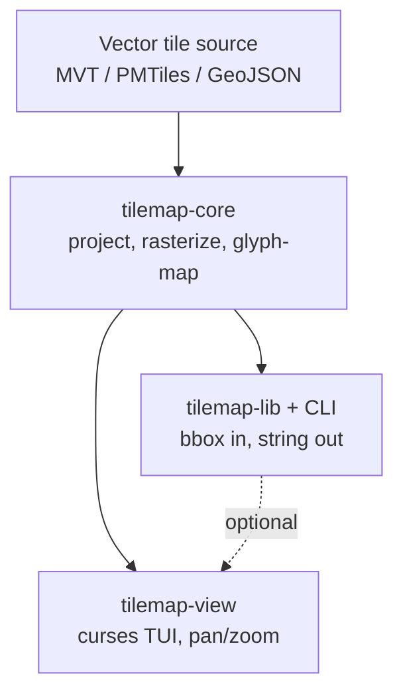
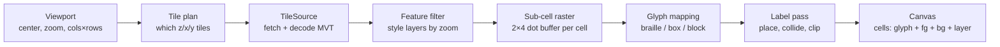
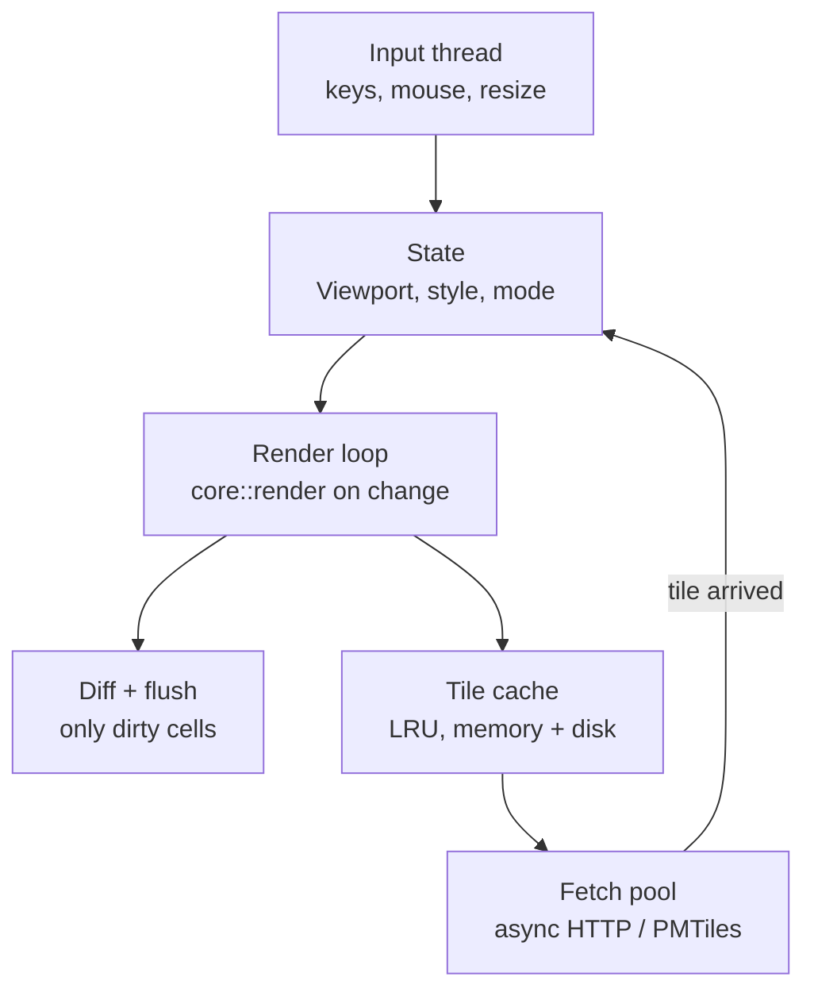

# Terminal Map Renderer — Design

2026-09-17 · @Someone

Implementation spec for Claude Code: a Java 21 / Gradle (Groovy DSL) multi-project that renders vector map tiles as Unicode text. Build the modules in the milestone order at the end; each milestone's "done when" is the acceptance test. Where this document is silent, prefer the simplest deterministic choice and add a unit test.

## Overview

Three pieces, one dependency direction: a shared rendering core, a headless library/CLI that wraps it, and an interactive viewer built on top. The core owns everything that turns vector map data into a grid of glyphs; the two products only decide how to obtain a viewport and where to send the resulting text.



The viewer does not depend on the CLI, but both use the same core; anything that feels viewer-specific (frame timing, key handling) stays out of the core, anything that affects what a pixel looks like goes in.

| Component | Gradle subproject | Deliverable | Depends on | Primary user |
| --- | --- | --- | --- | --- |
| tilemap-core | `:core` | plain JAR, no runtime deps beyond the MVT decoder | none | the other two |
| tilemap-lib | `:lib` and `:cli` | library JAR + `tilemap` fat JAR (`application` plugin) | `:core` | scripts, other JVM programs, pipelines |
| tilemap-view | `:view` | `tilemap-view` fat JAR | `:core` | a person at a terminal |

Language is Java 21 (records, sealed interfaces, switch patterns, virtual threads for tile fetching). No Kotlin, no Lombok. Build with Gradle 8.x using the Groovy DSL; the layout and build files are specified in the next section.

## Project layout and build

One Gradle root with four subprojects; `:core` must stay free of terminal, HTTP, and CLI dependencies so it is usable from any JVM program.

```
tilemap/
  settings.gradle
  build.gradle                 # shared config only, no code
  gradle/libs.versions.toml    # version catalog
  core/   src/main/java/dev/tilemap/core/...
  lib/    src/main/java/dev/tilemap/lib/...
  cli/    src/main/java/dev/tilemap/cli/...
  view/   src/main/java/dev/tilemap/view/...
  fixtures/town.geojson        # shared test fixture, read by all modules' tests
```

`settings.gradle`:

```groovy
rootProject.name = 'tilemap'
include 'core', 'lib', 'cli', 'view'
```

Root `build.gradle`:

```groovy
subprojects {
    apply plugin: 'java'
    group = 'dev.tilemap'
    version = '0.1.0-SNAPSHOT'
    java { toolchain { languageVersion = JavaLanguageVersion.of(21) } }
    repositories { mavenCentral() }
    dependencies {
        testImplementation platform(libs.junit.bom)
        testImplementation 'org.junit.jupiter:junit-jupiter'
        testRuntimeOnly 'org.junit.platform:junit-platform-launcher'
    }
    tasks.withType(Test).configureEach { useJUnitPlatform() }
    tasks.withType(JavaCompile).configureEach { options.encoding = 'UTF-8' }
}
```

Per-module dependencies:

| Module | `build.gradle` additions | Dependencies |
| --- | --- | --- |
| `:core` | `apply plugin: 'java-library'` | `com.google.protobuf:protobuf-java` (MVT decode) only; `jackson-databind` is allowed for `Style` file parsing |
| `:lib` | `java-library` | `project(':core')`, `jackson-databind`, JDK `java.net.http` for tiles (no OkHttp) |
| `:cli` | `application`, `mainClass = 'dev.tilemap.cli.Main'`, shadow/fat JAR task | `project(':lib')`, `info.picocli:picocli` |
| `:view` | `application`, `mainClass = 'dev.tilemap.view.Main'`, fat JAR | `project(':core')`, `project(':lib')`, `com.googlecode.lanterna:lanterna:3.1.x` |

Conventions Claude Code should follow throughout:

- Public types are `record`s or `sealed interface`s where the data is a value; mutable state lives only in the viewer's `AppState` and the caches.
- Rendering is deterministic: same inputs, same `Canvas`, byte-for-byte; no `HashMap` iteration order in any rendering path (use `LinkedHashMap` or sort), no wall-clock reads in `:core`.
- Every module has tests; `:core` tests are golden-file tests against `fixtures/town.geojson` and must pass with `gradle :core:test` in under 10 s.
- Style and config files are JSON, parsed with Jackson; no YAML/TOML.

## Shared library: tilemap-core

The core is a pure function from (viewport, style, terminal capabilities) to a `Canvas` of cells; it performs no I/O except through a caller-supplied `TileSource`. Keeping it pure makes it testable with golden-file snapshots and lets both products cache and thread it as they like.

### Pipeline



Each stage is a separate module with its own tests; stages E–G write into the same `Canvas`, later stages overwriting earlier ones by layer priority.

### Core types

| Type (package `dev.tilemap.core`) | Shape | Notes |
| --- | --- | --- |
| `Viewport` | `record(LonLat center, double zoom, int cols, int rows, double cellAspect)` | zoom is fractional; tile z = `(int) Math.floor(zoom)` |
| `TileSource` | `interface { Optional<Tile> fetch(TileId id) throws TileException; }` | impls in `:lib`: HTTP, PMTiles; in `:core`: `GeoJsonTileSource` (in-memory) and `EmptyTileSource` for tests |
| `Tile` | `record(TileId id, List<Layer> layers)`; `Layer` = `record(String name, List<Feature> features)` | decoded from MVT protobuf, coords in tile-local 0–4096 |
| `Feature` | `record(Geometry geom, Map<String,String> tags)`; `Geometry` = `sealed interface` permits `Point, Line, Polygon` | as decoded; no styling |
| `Style` | `record(List<StyleLayer> layers)` loaded from JSON | each `StyleLayer` = source layer, tag filter, zoom range, `Paint` |
| `Paint` | `record(PaintKind kind, Rgb fg, Rgb bg, Weight weight, GlyphStrategy strategy)` | `Weight` enum selects light/heavy/double box lines |
| `DotBuffer` | `int w = cols*2, h = rows*4; short[] owner` | one entry per braille dot; stores the layer index that painted it, -1 = empty |
| `Canvas` | `record(int cols, int rows, Cell[] cells)`; `Cell` = `record(int codePoint, Rgb fg, Rgb bg, Attrs attrs, int layer)` | final output; no escape codes; `Cell` uses code points, not `char`, because sextants are outside the BMP |
| `Capabilities` | `record(Charset charset, ColorDepth color)`; enums `ASCII, LATIN1, BOX, BRAILLE, SEXTANT` and `NONE, C16, C256, TRUE` | picked by the caller, not detected here |

### Rasterization

Geometry is projected from tile-local coordinates to dot space (Web Mercator, then scaled by the viewport). Polygons are scan-converted with even-odd fill; lines use Bresenham on the dot grid with a configurable dot width. Because a cell is roughly 1:2 (w:h), the dot buffer is 2×4 per cell, which is already close to square dots; `cell_aspect` corrects the remainder.

### Glyph strategies

Each `StyleLayer` names a strategy; strategies are applied in layer order and only touch cells whose top-priority layer is theirs.

| Strategy | Charset needed | Input | Output rule |
| --- | --- | --- | --- |
| `Braille` | U+2800–28FF | 2×4 dot mask | direct bit-to-codepoint mapping (256 glyphs) |
| `Sextant` | Unicode 13 | 2×3 dot mask | resample 2×4 to 2×3, map to U+1FB00 block |
| `Block` | U+2580–259F | 2×2 quadrant mask | ▘▝▖▗ combinations; fallback `▀▄█` |
| `Shade` | `░▒▓█` | coverage 0–1 per cell | threshold to one of four densities |
| `BoxLine` | U+2500–257F | road connectivity mask (N/E/S/W, weight) | table lookup: mask → `┃━┏┓┗┛┣┫╋` etc.; light vs heavy vs double by weight |
| `Marker` | any | point | a single glyph (`●`, `▲`, `⌂`) at the cell |
| `Ascii` | ASCII only | any of the above | degrade table: braille → `.:'` density, box → \`- |

Road rendering is the one strategy that does not go through the dot buffer. Lines are first drawn into a separate per-cell connectivity grid (which of the four neighbors the road continues into); the `BoxLine` table then picks the joint glyph. That is what makes intersections look like intersections rather than blobs.

### Public API (sketch)

```java
package dev.tilemap.core;

public final class Renderer {
    public static Canvas render(Viewport vp, Style style, Capabilities caps, TileSource src)
            throws RenderException;
    public static List<TileId> tilesFor(Viewport vp);     // lets callers prefetch
}

public final class Styles {
    public static Style defaultStyle();                    // OSM-ish: water, land, roads, buildings, POIs
    public static Style fromJson(Reader json);
}

public record Canvas(int cols, int rows, Cell[] cells) {
    public String toAnsi(Capabilities caps);              // escape sequences per row, no diffing
    public String toPlain();                              // glyphs only
    public Cell cell(int col, int row);
}
```

The core never writes to stdout and never reads config files; it takes and returns values.

## Viewer: tilemap-view

The viewer is a full-screen TUI that keeps a `Viewport` as its only real state, re-renders through the core whenever it changes, and diffs the new `Canvas` against the last one so pans redraw only changed cells. It owns tile caching, async fetching, and terminal detection; it owns nothing about how a map looks.

### Architecture



Render runs on the main thread and never blocks on network: if a tile is missing, the core is handed a cache-only `TileSource` that returns `Empty` for absent tiles, and the fetch pool posts a redraw event when the tile lands. Missing tiles show as a `░` placeholder layer.

Terminal I/O goes through Lanterna's `Terminal`/`Screen` layer only (no `TextGUI`): `Screen.setCharacter` per dirty cell and one `refresh()` per frame gives the diffing for free. Input is read on a dedicated platform thread; tile fetches run on virtual threads (`Executors.newVirtualThreadPerTaskExecutor()`) and post to a `LinkedBlockingQueue<Event>` the render loop drains.

### Input

| Key | Action |
| --- | --- |
| `h j k l` / arrows | pan by 1 cell (dot-level pan at high zoom) |
| `H J K L` / shift-arrows | pan by half a screen |
| `+ -` / `= _` | zoom in/out by 1; `[` `]` by 0.25 |
| mouse drag / wheel | pan / zoom (if terminal reports mouse) |
| `g` | go to: type lon,lat or a place name (geocoder optional) |
| `s` | cycle style presets (default, dark, ascii-only, high-contrast) |
| `c` | toggle color depth (true → 256 → 16 → none) for testing |
| `i` | inspect: show tags of the feature under the cursor |
| `y` | copy current view as plain text / ANSI to clipboard (OSC 52) |
| `?` | help overlay |
| `q` | quit |

### Rendering loop

1. Input event mutates `Viewport` (or style/caps) and sets a dirty flag.
2. On dirty, compute `tiles_for(vp)`; enqueue misses to the fetch pool.
3. Call `core::render` with the cache-only source; time budget \~16 ms at 200×60, degrade to `Shade` strategy if exceeded.
4. Diff against the previous `Canvas`; emit cursor-move + cell writes only for changes; flush once.
5. Draw the status bar (center coords, zoom, tile count, fetch queue depth) on the last row.

On resize, the whole canvas is invalidated and step 3 runs with the new cols/rows.

### Caching

- Memory: LRU of decoded `Tile`s, keyed by z/x/y, default 512 tiles (\~50–100 MB for dense city tiles).
- Disk: raw MVT bytes under `$XDG_CACHE_HOME/tilemap/{z}/{x}/{y}.mvt`, honoring `Cache-Control` max-age from the server.
- Prefetch: after each render, enqueue the ring of tiles one step out in each direction and the parent tile, so a pan or zoom-out usually hits cache.

### Terminal detection

The viewer fills `Capabilities` at startup and lets the user override with flags. Detection order: `--unicode`/`--color` flags, then `$COLORTERM=truecolor`, `$TERM`, and a probe write of a braille glyph with a cursor-position query to see whether the terminal advanced one column (this catches terminals that render braille as two-wide or as tofu).

### Configuration

One JSON file at `$XDG_CONFIG_HOME/tilemap/config.json` (falling back to `~/.config/tilemap/config.json`), read with Jackson into a `ViewerConfig` record: tile source URL (with `{z}/{x}/{y}` template) or PMTiles path, API key, default style, cache sizes, key bindings. Any style file usable by the CLI is usable here.

## Headless library and CLI: tilemap-lib

tilemap-lib is a thin convenience layer: it turns a bounding box or center+zoom into a `Viewport`, brings its own blocking `TileSource` with a small cache, and returns a string. The CLI is a 100-line wrapper over it. Everything that would tempt this layer to grow (styles, glyph rules) lives in the core, so the library stays stable.

### Library API

```java
package dev.tilemap.lib;

public record MapRequest(
        Area area,                 // sealed: Area.BBox(w,s,e,n) | Area.Center(lon,lat,zoom)
        int cols, int rows,
        Style style,               // Styles.defaultStyle() if null
        Capabilities caps,
        SourceConfig source        // sealed: Url(template,key) | PmTiles(path) | GeoJson(bytes)
) {}

public enum Format { PLAIN, ANSI, HTML, SVG, JSON }

public final class TileMap {
    public static String renderString(MapRequest req, Format fmt) throws TileMapException;
    public static Canvas renderCanvas(MapRequest req) throws TileMapException;  // for callers that want cells
}
```

`Area.BBox` picks the largest zoom at which the box fits in cols×rows and centers it; `Area.Center` is passed through. `MapRequest` has a Jackson mapping (`MapRequestJson`), so the same record is the CLI's `--request FILE` input and a good cache key when hashed.

### Output formats

| Format | What it is | Use |
| --- | --- | --- |
| `Plain` | glyphs only, newline per row | logs, README, plain email, `figlet`-style pipelines |
| `Ansi` | glyphs + SGR color codes, reset per row | `cat` in a terminal, `less -R`, tmux panes |
| `Html` | `<pre>` with span colors, monospace font stack | web embeds, wikis, status pages |
| `Svg` | one `<text>` per row, colored `<tspan>`s | fixed-size images that stay text |
| `Json` | `Canvas` cells as an array of `{glyph, fg, bg, layer}` | other programs post-process (e.g. a game engine) |

### CLI

```
tilemap [--bbox W,S,E,N | --center LON,LAT --zoom Z]
        [--size COLSxROWS | --fit-terminal]
        [--style NAME|FILE] [--charset ascii|box|braille|sextant]
        [--color none|16|256|true] [--format plain|ansi|html|svg|json]
        [--source URL|FILE] [--no-labels] [-o FILE]
```

Examples:

- `tilemap --center -0.1276,51.5072 --zoom 14 --fit-terminal` — the view around Trafalgar Square, sized to the current tty.
- `tilemap --bbox 2.29,48.85,2.31,48.86 --size 120x40 --format html -o eiffel.html`
- `tilemap --center ... --charset ascii --color none` — what a real VT220 would get.
- `tilemap --source city.pmtiles ...` — fully offline.

Exit codes: 0 ok, 2 bad arguments, 3 tile fetch failure (partial render still written to stdout unless `--strict`).

### Embedding

Other JVM programs depend on `dev.tilemap:lib` from `mavenLocal()` (`gradle publishToMavenLocal`) and call `TileMap.renderCanvas` directly; a game engine can walk `Canvas.cells()` without touching strings. For non-JVM callers the `tilemap` CLI with `--format json` is the interface. A GraalVM `native-image` build of `:cli` is a stretch goal for startup time, not a requirement.

## Cross-cutting concerns

### Cell aspect ratio

A terminal cell is about 1:2 wide-to-tall, so the world must be sampled twice as densely horizontally as vertically or north-south distances look stretched. The core does this in projection: one column of cells spans half as many Mercator units as one row. `cell_aspect` (default 0.5) is exposed because fonts vary; the viewer can calibrate it by asking the user to eyeball a drawn circle.

### Labels

Labels are the hardest part and get their own pass after all geometry.

1. Collect label candidates from styled point features and named lines, with a priority (city > town > street) and a minimum zoom.
2. Sort by priority, then by distance from the viewport center.
3. For each candidate, try placements in order: right of anchor, left, above, below; for lines, along the longest horizontal-ish run.
4. Accept the first placement whose cells are free in a label occupancy grid and do not overwrite a higher-priority layer (roads may be covered, water may not). Mark those cells taken.
5. Truncate to a max width with `…`; drop entirely if fewer than 4 characters fit.

Labels are always rendered as plain text in the default foreground, never glyph-mapped, so they stay readable. A `--no-labels` flag skips the pass and is the fastest render mode.

### Color

Colors in `Style` are RGB; the core quantizes at output time based on `Capabilities.color`: nearest of the 6×6×6 cube for 256, a fixed lookup for 16, and none → attributes only (bold for major roads, dim for minor). Fill layers set `bg`, line and point layers set `fg`, so a road over water shows a road-colored glyph on a water-colored background without any blending logic.

Style presets ship as files: `default` (light), `dark`, `mono` (no color, relies on glyph weight), and `vt220` (ASCII, no color, bold only) as the honest baseline.

### Terminal capability matrix

| Terminal | Braille | Box | Sextant | True color | Notes |
| --- | --- | --- | --- | --- | --- |
| kitty, WezTerm, Alacritty, foot | yes | yes | yes | yes | target platforms |
| iTerm2, Windows Terminal | yes | yes | partial | yes | sextants need a recent font |
| GNOME Terminal, Konsole | yes | yes | partial | yes |  |
| macOS Terminal.app | yes | yes | no | no (256) |  |
| tmux / screen | passes through | yes | passes through | needs `Tc` / `RGB` set |  |
| real VT220 / DEC VT emulation | no | DEC line-drawing set only | no | no | use the `vt220` preset, `--charset ascii` |

Detection is the viewer's job; the CLI trusts flags and defaults to braille + 256 colors.

### Performance

- Target: a 200×60 viewport (400×240 dots) renders in under 16 ms from cached tiles on a warmed-up JVM; a 300×80 terminal under 40 ms. Measure with a JMH benchmark in `:core` (`gradle :core:jmh`), not with `System.nanoTime` in tests.
- Decode MVT once and keep decoded `Tile` records in the cache, not the protobuf bytes.
- Cull features whose bounding box misses the viewport before projection; skip polygons whose projected area is under one dot.
- Zoom 14–16 city tiles have 20–50k features; if a render exceeds budget, the core reports it via `RenderStats` and the viewer drops label and building layers first.
- Avoid allocation in the inner raster loops: `DotBuffer` and the connectivity grid are reused across frames in the viewer via a `RenderContext` the core accepts optionally.

### Testing

Golden-file tests: a checked-in GeoJSON fixture (one small town: river, ring road, grid streets, park, 20 labels) rendered at three zooms and four capability levels, compared byte-for-byte to stored `.txt` outputs. Any intentional rendering change regenerates the goldens in the same commit.

## Milestones and open questions

Build the core against a static fixture first; nothing network-related is needed until milestone 3, and the CLI becomes useful before the viewer does.

| # | Milestone | Done when |
| --- | --- | --- |
| 0 | Scaffold | `gradle build` passes with the four empty modules, version catalog, and one placeholder test each |
| 1 | Core: raster + braille | `fixtures/town.geojson` renders water and parks as braille via `Canvas.toPlain()`; golden tests pass |
| 2 | Core: roads + blocks | Box-line joints look right at intersections; block/shade/ascii fallbacks render the same fixture |
| 3 | Core + lib: MVT + HTTP source | A live tile from a vector tile server renders; PMTiles source works offline |
| 4 | CLI | `java -jar tilemap.jar --center --zoom --fit-terminal` prints a map; plain/ansi/html formats |
| 5 | Labels | Label pass with collision; the fixture's 20 labels place without overlap at zoom 15 |
| 6 | Viewer | Pan/zoom at 60 fps from cache, async fetch with placeholders, resize |
| 7 | Polish | Style presets, capability probe, disk cache, mouse, inspect mode |
| 8 | Stretch | Sextants, `publishToMavenLocal`, GraalVM native CLI, geocoder in the viewer |

### Open questions

- [ ] Terminal library: Lanterna (assumed; simplest `Screen` diffing, pure Java) or JLine 3 (better raw-mode and capability queries, more plumbing)? Decide at milestone 6; `:core` is unaffected either way.
- [ ] MVT decoding: hand-roll the protobuf decode over `protobuf-java` (small, no generated code) or use a ready decoder such as `mapbox-vector-tile-java`? Draft assumes hand-rolled to keep `:core` dependencies minimal.
- [ ] Tile source for development: a public OSM vector tile endpoint with terms that allow it, a self-hosted `tileserver-gl`, or ship a small PMTiles extract of one city as a second fixture?
- [ ] Should road connectivity be computed in dot space (smoother diagonals, harder joints) or cell space (cleaner box-drawing, jaggier curves)? Draft assumes cell space; worth prototyping both on milestone 2.
- [ ] Is the `JSON` output format worth keeping, or is `Canvas` via `mavenLocal` enough for JVM game-engine use?
- [ ] Does the viewer need a bookmarks/route layer (draw a GPX or GeoJSON overlay on top of tiles)? Cheap if the core accepts a `List<TileSource>` layered in order.
